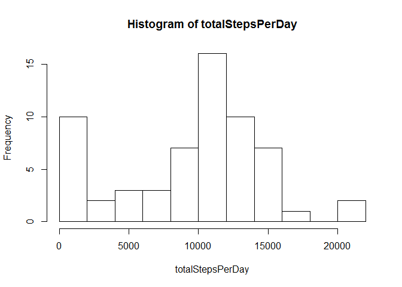
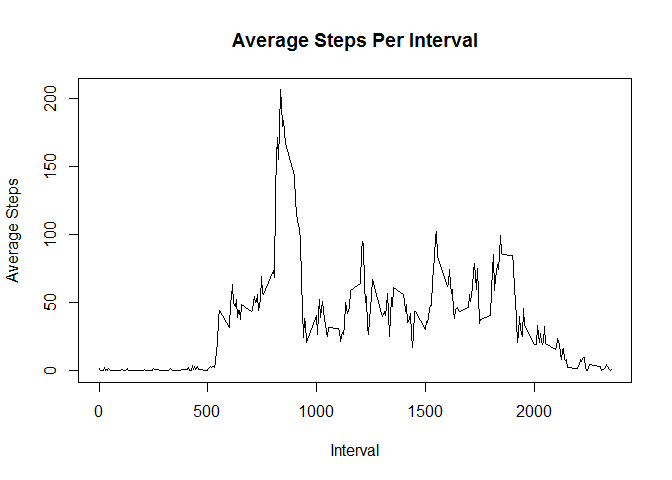
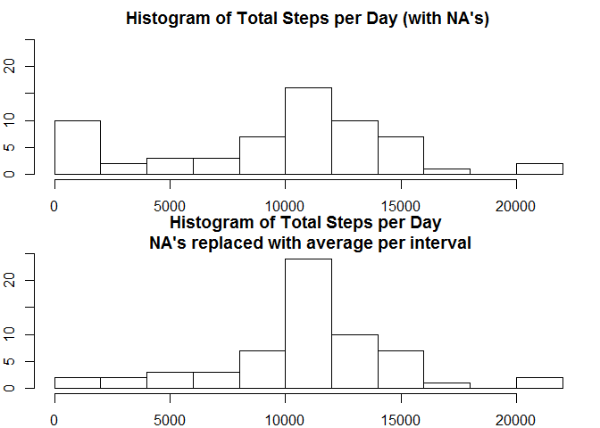
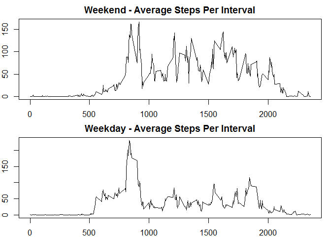

# Reproducible Research: Peer Assessment 1

*Donald Gray*

*12/14/14*

## Loading and preprocessing the data
This code assumes the file is in the "activity" directory and called "activity.csv".  
Read it in and convert date to the "date" class

```r
fileUrl <- "./activity/activity.csv"
if (!file.exists(fileUrl)) {stop(paste("Can't find file ",  fileUrl, "in working directory")) }
activityData <- read.csv(fileUrl, header=T)

activityData$date <- as.Date(as.character(activityData$date))
```


## What is mean total number of steps taken per day?
Split the data into days, then calculate total steps per day.  Plot these values and calc mean and median.  Ignore NA values.

```r
splitPerDay <- split(activityData, activityData$date) 
totalStepsPerDay <- sapply( splitPerDay, 
  function(dayData) {sum(dayData$steps, na.rm=T)} )

hist(totalStepsPerDay, breaks=10)
```

 

```r
mean(totalStepsPerDay)
```

```
## [1] 9354
```

```r
median(totalStepsPerDay)
```

```
## [1] 10395
```


## What is the average daily activity pattern?
Group the data by time interval.  Ignore missing data


```r
splitByInterval <- split(activityData, activityData$interval) 
avgStepsPerInterval <- sapply( splitByInterval, 
  function(intervalData) {mean(intervalData$steps, na.rm=T)} )
plot(names(avgStepsPerInterval), avgStepsPerInterval, type="l", xlab="Interval", ylab="Average Steps", main="Average Steps Per Interval")
```

 
Find which interval has the max # of steps (averaged over the time period).  We use "names" to get the interval, not the array index

```r
names(which(avgStepsPerInterval==max(avgStepsPerInterval)))
```

```
## [1] "835"
```
So interval 835 has the highest # steps, which corresponds to what we see in the plot

## Imputing missing values
Calc total number of NA's:

```r
sum(is.na(activityData$steps))
```

```
## [1] 2304
```

Now manage the NA's by imputing them from the rest of the data.
We'll replace NA's with the mean value for the corresponding interval

```r
imputedActivityData <- activityData
naVals <- is.na(imputedActivityData$steps)  #logical vector indicating which data are NA

#for rows which have NA in the "steps" column, replace with the looked up average for the corresponding interval.  We use 'as.character' to lookup the named numeric vector
imputedActivityData[naVals,"steps"] <- sapply(imputedActivityData[naVals,"interval"], 
  function(theInterval) avgStepsPerInterval[as.character(theInterval)])
```

Now we'll look at the total steps per day of this imputed data and compare to the original

```r
impSplitPerDay <- split(imputedActivityData, imputedActivityData$date) 
impTotalStepsPerDay <- sapply( impSplitPerDay, 
  function(dayData) {sum(dayData$steps, na.rm=T)} )

par(mfrow = c(2, 1), mar=c(2,2,2,1))
hist(totalStepsPerDay, breaks=10, ylim=c(0,25), main="Histogram of Total Steps per Day (with NA's)")
hist(impTotalStepsPerDay, breaks=10, ylim=c(0,25), main="Histogram of Total Steps per Day \n NA's replaced with average per interval")
```

 

```r
mean(totalStepsPerDay); mean(impTotalStepsPerDay)
```

```
## [1] 9354
```

```
## [1] 10766
```

```r
median(totalStepsPerDay); median(impTotalStepsPerDay)
```

```
## [1] 10395
```

```
## [1] 10766
```
Clearly the histograms are different and both the mean and median have shifted.


```r
summary(totalStepsPerDay)
```

```
##    Min. 1st Qu.  Median    Mean 3rd Qu.    Max. 
##       0    6780   10400    9350   12800   21200
```

```r
summary(impTotalStepsPerDay)
```

```
##    Min. 1st Qu.  Median    Mean 3rd Qu.    Max. 
##      41    9820   10800   10800   12800   21200
```
Looking at the summaries and the plots, it is particularly clear that the NA's were treated as zero, which shifted the mean and median down

## Are there differences in activity patterns between weekdays and weekends?
Use 'weekdays' function to find day of week.  Then create a factor variable which indicates weekday or weekend

```r
imputedActivityData$weekday <- weekdays(imputedActivityData$date)
imputedActivityData$daytype <- ( weekdays(imputedActivityData$date)=="Saturday" | weekdays(imputedActivityData$date)=="Sunday")
#convert daytype into a factor variable
imputedActivityData$daytype <- factor(imputedActivityData$daytype, labels=c("weekday", "weekend"))
```


Now calculate average steps per interval for weekdays and weekends, and plot them.
 
We see some signs of behavioral differences, such as, more activity earlier on a weekday, but then more steps throughout the latter part of the day and into the evening for the weekend.

